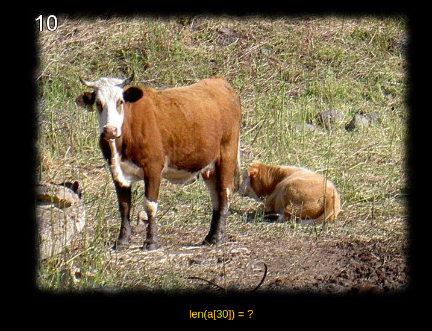
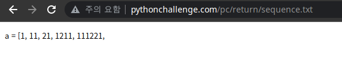
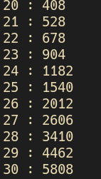

# lv 10. Look and Say Sequence

link: http://www.pythonchallenge.com/pc/return/bull.html  
**Problem**

  
a is ..   

**Solution**

1. 1 -> 11 means One "1".  
2. 11 -> 21 means Two "1".  
3. 21 -> 1211 means One "2" and Two "1".
4. It is called "Look and Say sequence."  
5. follow rule and check length   
   
