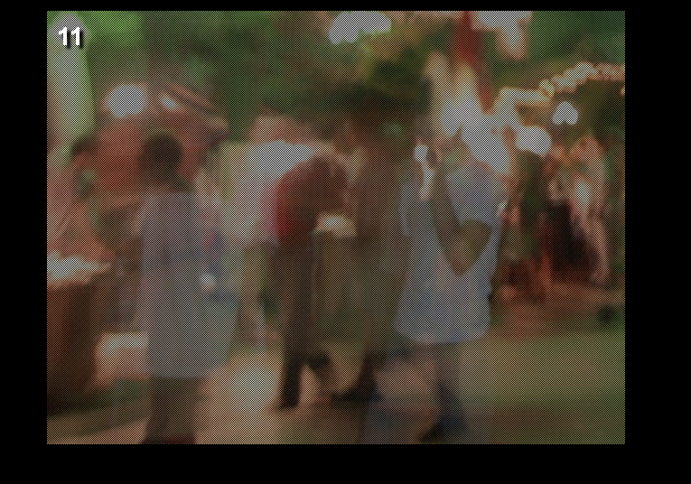
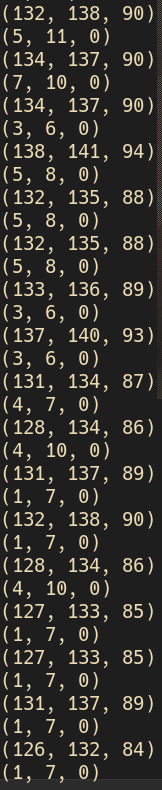
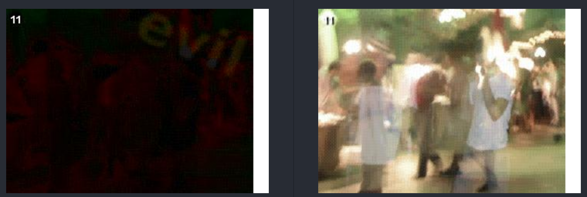

# lv 11. Image

link: http://www.pythonchallenge.com/pc/return/5808.html  
**Problem**

  
just image

**Solution**

1. title is odd even  
2. hmm..? check all pixel  
  
3. separating the pixels  
4. check two images(left: odd / right: enve)  
