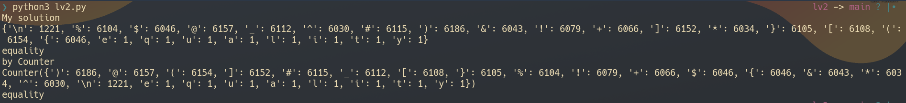

# lv 2. Counter

link: http://www.pythonchallenge.com/pc/def/ocr.html

**Problem**  

> find rare characters in the mess below:

You can check it in the page source code.

**Solution**

My solution is counting all characters by "loop"

Surprisingly, Python had this built-in function.

Anyway, rare characters are [e, q, u, a, l, i, t, y]

