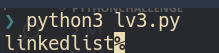

# lv 3. Regular Expression

link: http://www.pythonchallenge.com/pc/def/equality.html

**Problem**  

> One small letter, surrounded by EXACTLY three big bodyguards on each of its sides.

You can check mess string in the page source code.

**Solution**

hint means middle character in "Uppercase * 3/lorcase/Uppercase * 3" string

check it in give text by using re module

regular expression is "[a-z][A-Z]{3}[a-z][A-Z]{3}[a-z]"

