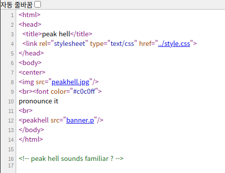

# lv 5. Pickle

link: http://www.pythonchallenge.com/pc/def/peak.html  
**Problem**  

  
??? mmm... banner.p..?  

holy!

**Solution**

I didn't know Pickle. I thought about it for a few days and eventually searched it and found out.

banner.p is string. Therefore, I can get some data from pickle.loads().   
But, Only the complicated list welcomed me.  
That had many characters and I printed out  characters as many times as characters was tied to a tuple. 

