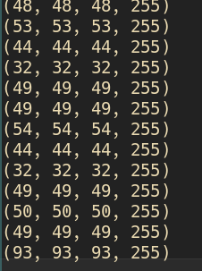
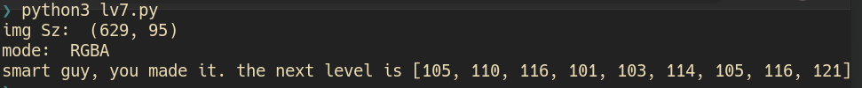
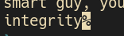

# lv 7. Image

link: http://www.pythonchallenge.com/pc/def/oxygen.html  
**Problem**  

  
only one image. 

**Solution**

1. image have achromatic(?) color line  
2. check all points that pixel's RGB values are all same   
   
3. RGB value less than 128 -> ASCII?  
  
4.105~121 list -> ASCII!  

