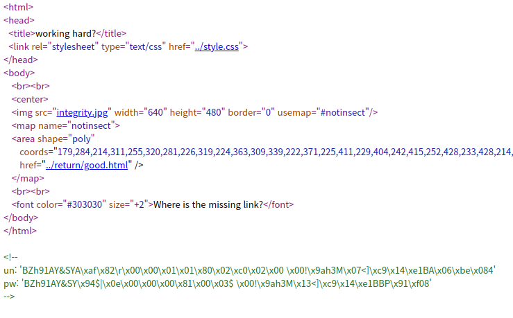
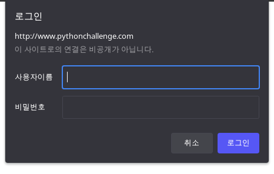
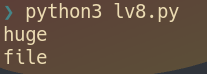

# lv 8. bzip2

link: http://www.pythonchallenge.com/pc/def/integrity.html
**Problem**

  
and href = "..." is below  

**Solution**

1. "BZh91AY&SY" is common prefix in username and password
2. bz...? -> bzip2! python already have this module as 'bz2'
3. decompress and type it in  
   
