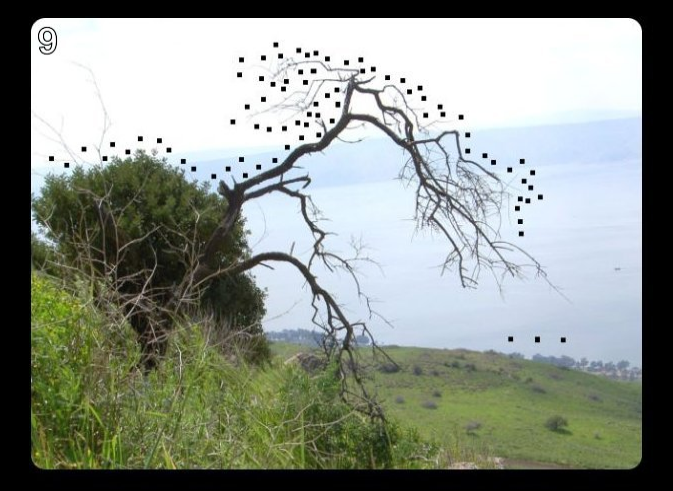
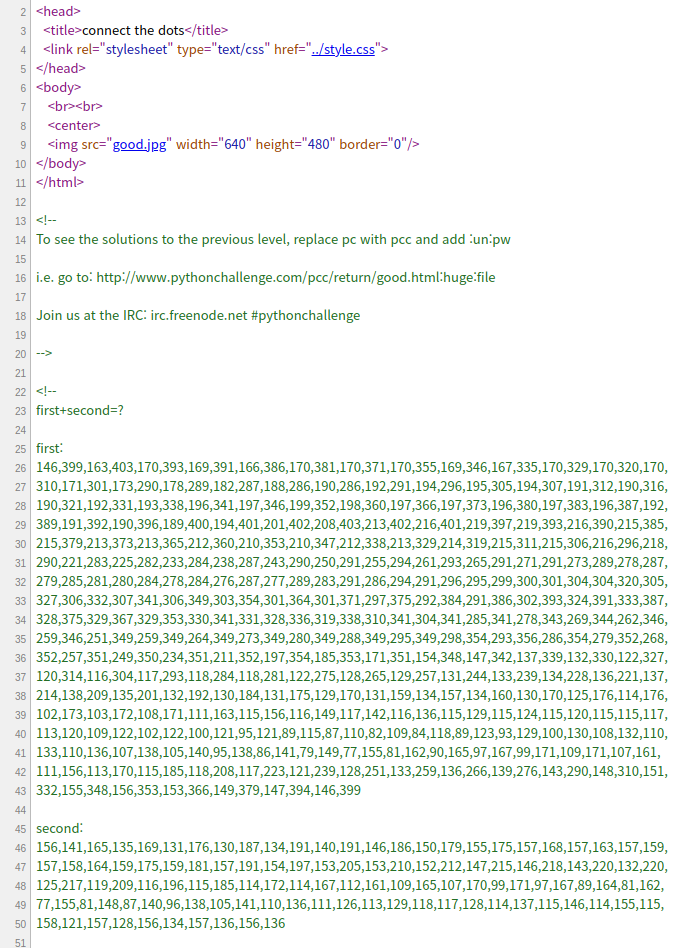
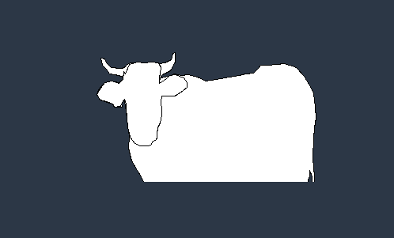

# lv 9. tkinter

link: http://www.pythonchallenge.com/pc/def/good.html
**Problem**

  
and page source  
  
coords first & second  
**Solution**

1. html title is connect the dots -> tkinter create polygons  
2. first & second..? -> draw order  
3. draw polygon using tkinter  
  
4. answer is cow..?  
  
5. answer is bull !!
